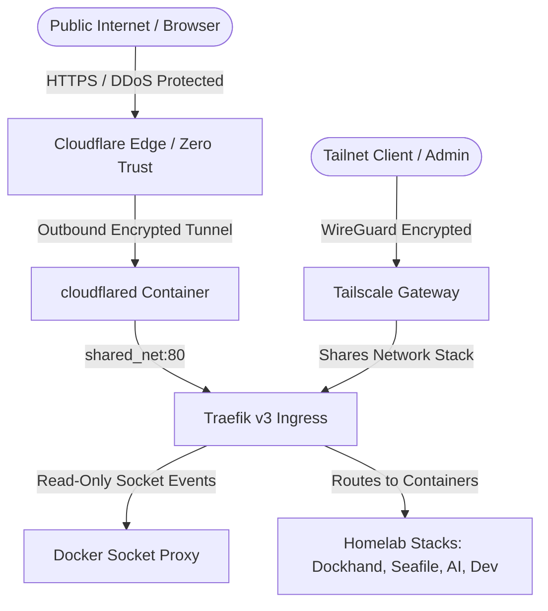

# 🌐 Homelab Gateway Stack

A dedicated, highly secure, containerized ingress gateway and network router featuring **Traefik v3**, **Tailscale Mesh VPN**, **Cloudflare Zero Trust Tunnel**, and a read-only **Docker Socket Proxy**.

This stack acts as the universal network ingress layer for all services and applications across your homelab.

---

## 🏛️ Architecture Overview



---

## 🔒 Security Highlights

1. **Dedicated Infrastructure Layer:** Operates independently of application containers. Upgrading, restarting, or deploying application stacks will never interrupt the gateway or drop network connectivity.
2. **Dual Ingress (Tailscale + Cloudflare):**
   - **Private Mesh:** Direct encrypted access via Tailscale (`https://<service>.homelab-gw.ts.net`).
   - **Public Edge:** Secure public access via Cloudflare Tunnel without opening any router ports or exposing your home IP.
3. **Docker Socket Proxy Isolation:** Traefik interacts with Docker through a locked-down, read-only TCP proxy (`socket-proxy:2375`) rather than mounting the raw `/var/run/docker.sock`.
4. **Universal Routing via `shared_net`:** Connected to `shared_net` so Traefik automatically discovers and routes to any container on the host with `traefik.*` labels.

---

## 🚀 Quick Start

### 1. Configure Environment
```bash
cp .env.example .env
nano .env
```

Set your configuration values:
- **`TS_AUTHKEY`**: Your Tailscale auth key from the [Tailscale Admin Console](https://login.tailscale.com/admin/settings/keys).
- **`TS_HOSTNAME`**: Hostname for the gateway on your tailnet (default: `homelab-gw`).
- **`CLOUDFLARE_TUNNEL_TOKEN`**: Your Tunnel token from [Cloudflare Zero Trust](https://one.dash.cloudflare.com/) (Networks $\rightarrow$ Tunnels).

---

### 2. Cloudflare Zero Trust Tunnel Setup

1. In the **Cloudflare Zero Trust Dashboard**, navigate to **Networks $\rightarrow$ Tunnels**.
2. Create a new Cloudflare Tunnel (e.g. `homelab-tunnel`) and paste the **Tunnel Token** into `CLOUDFLARE_TUNNEL_TOKEN` in `.env`.
3. Under the **Public Hostnames** tab of the tunnel:
   - **Public Hostname:** `*.yourdomain.com` (or specific subdomains like `dockhand.yourdomain.com`, `cloud.yourdomain.com`)
   - **Service Type:** `HTTP`
   - **URL:** `gateway_tailscale:80` (or `gateway_traefik:80`)

---

### 3. Deploy the Gateway
```bash
docker compose up -d
```
The `init-volumes` container will automatically create all persistent storage paths under `${GATEWAY_HOME}/volumes` with correct permissions.

---

## ⚙️ Log Rotation & Management

All containers are pre-configured with JSON log rotation (`max-size: 10m`, `max-file: 3`) to prevent host storage bloat.

To view logs:
```bash
docker compose logs -f traefik
```
